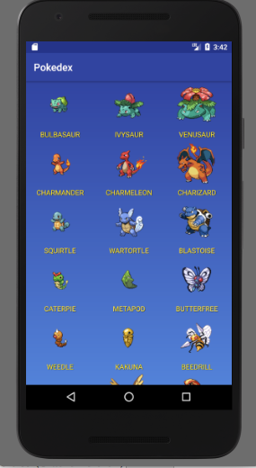

# Pokedex Android App

Create a team of Pokemon by searching the PokeAPI database for 1st Generation Pokemon. I use the Retrofit library to send RESTful requests to the PokeAPI and then turn the given information into JSON objects to display on screen.

Submitted for Mobile App I Project Fall 2017